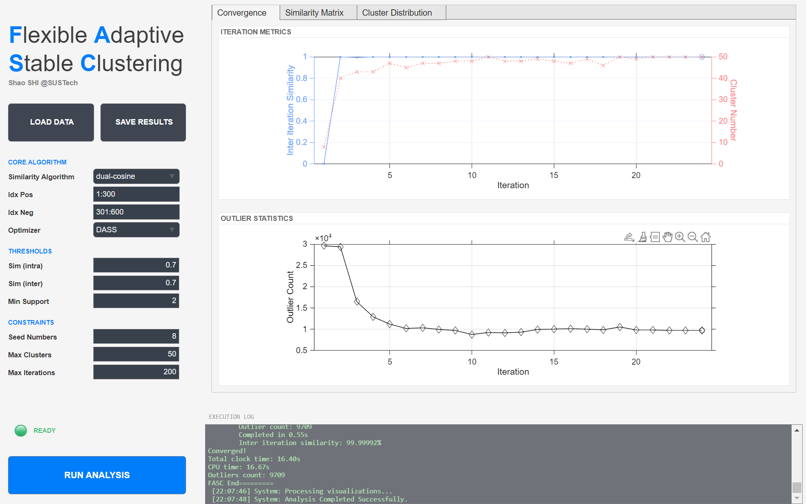

# FASC: Flexible Adaptive Stable Clustering

[](https://doi.org/10.5281/zenodo.17844844)
[](https://www.gnu.org/licenses/gpl-3.0)
[](https://www.mathworks.com/products/matlab.html)
[](https://cpquery.cnipa.gov.cn/)

**FASC** (Flexible Adaptive Stable Clustering) is a novel, high-performance clustering algorithm designed specifically for high-dimensional mass spectrometric big data.

Developed at **Southern University of Science and Technology (SUSTech)**, FASC addresses the challenges of clustering single-particle mass spectrometry (SPMS) data by combining density-based initialization with an adaptive resonance theory-inspired learning process. It effectively handles million-scale datasets with high stability and speed.

## Key Features

* **Adaptive Clustering:** Automatically determines the number of clusters based on data density and similarity thresholds, eliminating the need for pre-defined cluster counts.
* **Dual-Cosine Metric:** Incorporates a specialized "Dual-Cosine" similarity algorithm (Positive/Negative ion modes) optimized for chemical fingerprinting of atmospheric particles.
* **High Performance:** Fully vectorized and parallelized implementation using MATLAB's `parfor` and `parfeval` to accelerate processing of large datasets.
* **User-Friendly GUI:** Includes a complete App Designer interface for easy data loading, parameter tuning, and real-time monitoring.
* **Advanced Visualization:** Built-in tools for generating publication-quality similarity heatmaps, cluster distribution histograms, and convergence plots.

## Repository Structure

To facilitate reproducibility, the project is organized as follows:

```text
.
├── src/                # Core algorithm source code (FASC.m, FASC_GUI.m)
├── utils/              # Helper functions for visualization and analysis
├── data/               # Demo datasets (for reproducing examples)
├── LICENSE             # GNU GPLv3 License text
└── README.md           # Project documentation
````

## System Requirements

  * **Hardware:**
      * **CPU:** Multi-core processor recommended (4+ cores) for parallel processing.
      * **RAM:** Depending on the size of the dataset, e.g., we use ~200 GB RAM for the clustering of 25 million 300-D vectors (fp64) on CentOS Linux 7.
      * **Non-standard Hardware:** None required.
  * **Operating System:** Windows 10 or above, macOS (10.15+), or Linux (Ubuntu 20.04+, CentOS Linux release 7.5.1804 (Core)+).
  * **MATLAB:** R2021b or later for windows, 2020bu5 or later for Linux.
  * **Required Toolboxes:**
      * *Statistics and Machine Learning Toolbox* (for `pdist2`, distance metrics).
      * *Parallel Computing Toolbox* (for parallel acceleration).

## Installation

1.  **Clone the repository:**

    ```bash
    git clone [https://github.com/s129136908794904/FASC.git](https://github.com/s129136908794904/FASC.git)
    cd FASC
    ```

2.  **Setup MATLAB Path:**
    Open MATLAB, navigate to the `FASC` folder, and run the following command to add all subfolders to your path:

    ```matlab
    addpath(genpath(pwd));
    savepath;
    ```

Typical Install Time: < 2 minutes (assuming MATLAB is already installed).

## Data Availability

  * **Demo Data:** A subset (100,000) of the high-dimensional mass spectrometric dataset in our paper is provided in the `data/` folder of this repository to verify the algorithm's functionality.
  * **Full Dataset:** The complete high-dimensional mass spectrometric dataset used in the manuscript is available at **[Zenodo]** under DOI: **10.5281/zenodo.17788367**.

## Algorithm Implementation
  * For reviewers and researchers interested in the logic: The core clustering logic (pseudocode equivalent) is implemented in src/FASC.m.
  * Detailed mathematical formulations are provided in the Methods section of the accompanying manuscript.

## Graphical User Interface

FASC includes a user-friendly App Designer interface that allows researchers to visualize high-dimensional data clustering in real-time without writing code.



*Figure 1: The FASC GUI showing the main control panel (left) and the real-time visualization of clustering results (right) on the demo dataset.*

## Usage

### 1\. Graphical User Interface (Recommended)

The GUI is the easiest way to explore your data and tune parameters.

```matlab
% In MATLAB Command Window:
FASC_GUI
```

  * **Load Data:** Supports `.mat` files (containing a numeric matrix) and `.csv` files.
  * **Parameters:** Adjust `Sim (intra)` and `Sim (inter)` directly in the sidebar.
  * **Run:** Click **RUN ANALYSIS**. The interface runs asynchronously, allowing you to monitor progress logs.

-----

### 2\. Command Line Interface (Scripting)

For batch processing or integration into existing pipelines, use the core function directly.

#### Example Script

```matlab
% 1. Setup Environment
addpath(genpath(pwd)); % Ensure src/ and utils/ are in path
load(fullfile('data', 'dataMatrix.mat'), 'dataMatrix'); 

% 2. Define Parameters
% Define Column Indices (Required for 'dual-cosine', ignored for others)
idx_pos = 1:300;    % Positive spectrum features
idx_neg = 301:600;  % Negative spectrum features

% Thresholds & Constraints
sim_inter  = 0.70;      % Merge threshold (Inter-cluster)
sim_intra  = 0.70;      % Vigilance threshold (Intra-cluster)
seed_limit = 8;        % Max initial seeds
max_clust  = 50;        % Max allowed clusters
max_iter   = 200;       % Max iterations
min_vol    = 2;         % Minimum particles to form a valid cluster

% Strategy: 'DASS' (Density-Adaptive) or 'SF' (Similarity-First)
strategy   = 'DASS';    

% Metric: 'dual-cosine', 'cosine', 'euclidean', 'l1-norm', etc.
algorithm  = 'dual-cosine'; 

% 3. Run FASC Analysis
fprintf('Starting FASC Analysis...\n');
tic;
[centers, counts, labels, info] = FASC(...
    dataMatrix, ...           % dataMatrix
    idx_pos, idx_neg, ... % Ion mode indices
    sim_inter, ...      % Similarity Threshold (Inter)
    sim_intra, ...      % Similarity Threshold (Intra)
    seed_limit, ...     % Initial Seed Limit
    max_clust, ...      % Max Cluster Limit
    max_iter, ...       % Max Iteration Limit
    strategy, ...       % Optimization Strategy
    min_vol, ...        % Min Cluster Volume
    algorithm);         % Similarity Algorithm
toc;

% 4. Generate Visualizations (Using built-in helper functions)
% These functions generate the same plots as the GUI.

% Define output directory for figures
outDir = fullfile(pwd, 'results', filesep);
if ~exist(outDir, 'dir'), mkdir(outDir); end

% A. Plot Convergence & Outlier Stats
% Usage: Clustering_iterInfoAnalyzer(infoStruct, ifPlot, ifSave, FileName, SaveDir)
Clustering_iterInfoAnalyzer(info, true, true, 'Demo_Convergence', outDir);

% B. Plot Similarity Heatmap & Distribution
% Usage: Clustering_clusterListCountsHister(counts, centers, sim_threshold, algo, pos, neg, ifPlot, ifSave, FileName, SaveDir)
Clustering_clusterListCountsHister(...
    counts, centers, sim_inter, algorithm, idx_pos, idx_neg, ...
    true, true, 'Demo_Heatmap', outDir);

fprintf('Analysis complete. Results saved to %s\n', outDir);
```

#### Expected Output

* **Console Output:**
    The script provides real-time feedback on the algorithm's stability and convergence progress:
    ```text
    =========FASC Start
    Iteration 1 start
    ...
    Iteration 22 start 
      Current cluster count: 50 
      No cluster merged 
      Outlier count: 10143
      Completed in 0.44s
      Inter iteration similarity: 99.99991%
    Converged!

    Total clock time: 11.99s
    CPU time: 38.62s

    Outliers count: 10143
    FASC End=========
    ```

* **Workspace Variables:**
    * `centers`: Matrix $(K \times D)$ containing the centroids of the $K$ identified clusters.
    * `counts`: Vector $(K \times 1)$ containing the number of particles in each cluster.
    * `labels`: Vector $(N \times 1)$ containing the cluster assignment ID for each particle ($0$ indicates an unassigned outlier).
    * `info`: Structure containing iteration history, convergence metrics, and CPU timing data.

* **Generated Figures (Saved in `results/`):**
    1.  **Convergence Plot:** A dual-axis graph showing the stabilization of "Inter-Iteration Similarity" and "Cluster Count" over time.
    2.  **Outlier Statistics:** A plot tracking the number of unassigned particles (outliers) per iteration.
    3.  **Similarity Heatmap:** A visual matrix showing the Dual-Cosine similarity between the final cluster centers.
    4.  **Cluster Distribution:** A bar chart displaying the fraction of total particles assigned to each cluster ID.
    

## License & Patent Notice

### Copyright © 2025 Shao Shi, Southern University of Science and Technology (SUSTech).

#### 1\. Open Source License (GPLv3)

This software is provided under the **GNU General Public License v3.0 (GPLv3)**.

  * **You are free to:** Run, study, share, and modify the software for academic and non-commercial research.
  * **Conditions:** Any modifications or derived works must be open-sourced under the same GPLv3 license.

#### 2\. Patent Notice

> **The core algorithm implemented in this software is protected by China Invention Patent.**
>
>   * **Patent No.:** ZL 2025 1 0839139.3
>   * **Status:** Granted
>   * **Academic Use:** Free and unrestricted for non-commercial research and educational purposes.
>   * **Commercial Use:** Any commercial use (including integration into commercial software/hardware) is **strictly prohibited** without a separate commercial license. Please contact the author for licensing inquiries.

## Citation

If you use FASC or its GUI in your research, please cite our paper:

> **FASC: A Flexible Adaptive Stable Clustering Algorithm for Archive-Scale Mass Spectrometry**
> Shao Shi, et al.
> *Manuscript Submitted / Under Review*, 2025.
> (The full citation and DOI will be updated upon publication.)

## Contact

**Shao Shi (石邵)**
School of Environmental Science and Engineering
Southern University of Science and Technology (SUSTech)
Shenzhen, China
Email: [12231091@mail.sustech.edu.cn]
GitHub: [https://github.com/s129136908794904](https://github.com/s129136908794904)

***Prof. Xin Yang**
School of Environmental Science and Engineering
Southern University of Science and Technology (SUSTech)
Shenzhen, China
Email: [yangx@sustech.edu.cn]
