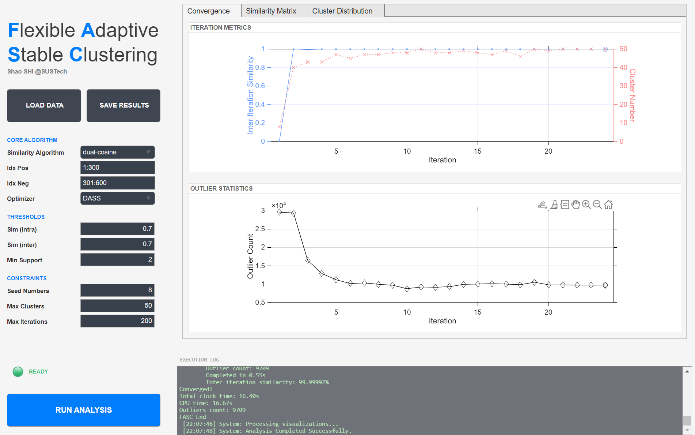

# Flexible Adaptive Stable Clustering (FASC)

[](https://doi.org/10.5281/zenodo.17844844)
[](LICENSE)

FASC is a capacity-controlled clustering framework for archive-scale,
high-dimensional data. The repository contains authoritative MATLAB and
Python implementations of the same state-transition logic and a public
external-label benchmark.

The accompanying manuscript is:

> Flexible Adaptive Stable Clustering for Archive-Scale High-Dimensional
> Data: Application to Online Mass Spectrometry

## What "Stable" Means

Stability has two operational components in FASC:

1. With fixed parameters and canonical tie rules, the state transition is
   permutation-equivariant in exact arithmetic. Reordering input rows
   reorders labels but does not change the induced partition.
2. Once the capacity schedule is fixed, the deterministic finite-state
   trajectory must reach a fixed point or a finite recurrent cycle. FASC
   detects repeated canonical label states and resolves a detected cycle
   deterministically.

For a cycle, FASC returns the highest-scoring mature state within that
detected period under the configured cycle score. This is not a claim of a
global optimum, monotone improvement on every transition, or Lyapunov
stability under perturbations of the data.

## Assignment Rules

Similarity-first (SF) is the basic assignment rule. An observation is
assigned to the most similar representative among those that pass the
assignment threshold.

Data-Support-Augmented Similarity Selection (DASS) is optional. Among
threshold-admissible representatives, it ranks cluster `j` using

```text
similarity(x_i, c_j) + lambda * phi(n_j)
```

where `n_j` is cluster support (occupancy), not a spatial-density estimate.
For comparisons across sample sizes with `phi(n) = n`, a relative support
parameterization such as `lambda = alpha / N` avoids changing the balance
solely because `N` changes.

The archive-scale SPMS application in the manuscript used DASS with
`lambda = 1` and `phi(n) = n`. This is a strong support preference among
representatives that already pass the dual-cosine acceptance threshold.

## Repository Layout

```text
.
|-- matlab/
|   |-- src/FASC.m              MATLAB reference implementation
|   |-- src/FASC_GUI.m          MATLAB graphical interface
|   |-- tests/test_FASC.m       MATLAB regression suite
|   `-- utils/                  Plotting and analysis helpers
|-- python/
|   |-- fasc_core.py            Python reference implementation
|   |-- tutorial.ipynb          Executable tutorial
|   `-- tests/test_fasc.py      Python regression suite
|-- benchmarks/
|   |-- run_external_benchmark.py
|   |-- test_benchmark.py
|   `-- results/                Versioned fixed-grid result tables
|-- data/dataMatrix.csv         Repository SPMS fixture
|-- LICENSE                     PolyForm Noncommercial 1.0.0
`-- NOTICE                      Project copyright and patent notice
```

## Requirements

Python core:

- Python 3.8 or later
- NumPy
- SciPy

Python tutorial and public benchmark:

- Matplotlib and Jupyter for the tutorial
- scikit-learn 1.3 or later for HDBSCAN and the benchmark datasets

MATLAB:

- MATLAB R2021b or later
- Statistics and Machine Learning Toolbox
- Parallel Computing Toolbox for the GUI and parallel score paths
- A Java-enabled MATLAB runtime for SHA-256 state fingerprints

The core functions accept an in-memory matrix. Assignment is blocked to
bound the similarity workspace, but the released interfaces are not
out-of-core loaders.

## Python Quick Start

From the repository root:

```python
import numpy as np
from python.fasc_core import run_fasc

data = np.loadtxt("data/dataMatrix.csv", delimiter=",")

centers, counts, labels, info = run_fasc(
    data_matrix=data,
    idx_pos=np.arange(0, 300),
    idx_neg=np.arange(300, 600),
    sim_inter=0.70,
    sim_inner=0.70,
    init_limit=8,
    max_clusters=50,
    max_iter=500,
    strategy="SF",
    min_vol=2,
    algo="dual-cosine",
    batch_size=100000,
    verbose=True,
    return_info=True,
)

print(info["terminationReason"])
print(len(counts), np.sum(labels == 0))
```

To reproduce the manuscript SPMS assignment rule, change the strategy and
make the support transformation explicit:

```python
centers, counts, labels, info = run_fasc(
    data,
    np.arange(0, 300),
    np.arange(300, 600),
    0.70,
    0.70,
    8,
    50,
    500,
    "DASS",
    2,
    "dual-cosine",
    lambda_weight=1.0,
    support_function=lambda n: n,
    batch_size=100000,
    return_info=True,
)
```

Python uses zero-based feature indices. Returned labels use the MATLAB
convention by default: `0` for an outlier and `1..K` for canonical cluster
identifiers. Set `label_convention="python"` only for compatibility with the
former `-1` and `0..K-1` convention.

The older keyword names `density_function` and
`density_potential_function` remain supported as aliases. New code should
use `support_function` and `support_potential_function`.

Run the tutorial with:

```bash
jupyter notebook python/tutorial.ipynb
```

## MATLAB Quick Start

```matlab
addpath(genpath(pwd));
dataMatrix = readmatrix(fullfile('data', 'dataMatrix.csv'));

idxPos = 1:300;
idxNeg = 301:600;

[centers, counts, labels, info] = FASC( ...
    dataMatrix, idxPos, idxNeg, ...
    0.70, 0.70, ...
    8, 50, 500, ...
    'SF', 2, 'dual-cosine', ...
    'BatchSize', 100000, ...
    'Verbose', true);

disp(info.terminationReason);
```

For the manuscript SPMS DASS setting:

```matlab
[centers, counts, labels, info] = FASC( ...
    dataMatrix, idxPos, idxNeg, ...
    0.70, 0.70, ...
    8, 50, 500, ...
    'DASS', 2, 'dual-cosine', ...
    'Lambda', 1, ...
    'SupportFunction', @(n) n, ...
    'BatchSize', 100000, ...
    'Verbose', true);
```

`DensityFunction` and `DensityPotentialFunction` remain accepted as
backward-compatible aliases. New MATLAB code should use `SupportFunction`
and `SupportPotentialFunction`.

Launch the graphical interface with:

```matlab
FASC_GUI
```



## Score and Representative Interface

MATLAB and Python provide the same built-in score names:

- `dual-cosine`
- `cosine`
- `euclidean` and `euclidean-distance`
- `l1`, `l1-norm`, and `manhattan`
- `minimum`, `maximum`, `algebraic`, `logarithmic`, and `geometric`
- `harmonic`, `enhanced harmonic`, `entropy`, and `weighted entropy`
- `best average` and `fitted core`

`dual-cosine` normalizes the two feature groups independently. Ordinary
cosine uses row-wise L2 normalization. The composition-oriented built-ins
use row-wise absolute-L1 preprocessing in both implementations.

A custom score should be supplied together with a deterministic
representative callback. The generic empirical-medoid fallback can require
quadratic work within a cluster and is intended for smaller datasets.

## Regression Tests

Python:

```bash
python -m unittest discover -s python/tests -v
python -m unittest discover -s benchmarks -p "test_*.py" -v
```

MATLAB:

```matlab
results = runtests(fullfile('matlab', 'tests'), ...
    'IncludeSubfolders', true);
assertSuccess(results);
```

The mirrored suites cover permutation equivariance, block-size equivalence,
dual-cosine scoring, all built-in scores, custom score/representative
callbacks, mature-state projection, recurrence handling, support callback
aliases, and a shared 1,000-row SPMS fixture. Python additionally checks
dense/sparse equivalence and the former label convention.

## Public External-Label Benchmark

The benchmark is independent of the SPMS data. It uses nine public labelled
datasets spanning image, trajectory, segmentation, speech, shape, and
tabular features. Labels are withheld from preprocessing, parameter
construction, and clustering, then used only for evaluation.

The fixed grid includes:

- FASC-SF and FASC-DASS
- HDBSCAN and OPTICS
- BIRCH without a supplied global cluster count
- deterministic batch DP-means without the reference class count
- oracle-K K-means as a separate feature-separability reference

Protocol details and commands are in
[`benchmarks/README.md`](benchmarks/README.md). Complete versioned results
are in [`benchmarks/results/`](benchmarks/results/).

## Data

`data/dataMatrix.csv` is a curated SPMS fixture for examples and regression
checks. Each row is one dual-polarity particle observation.

The archive-scale dataset contains 24,742,408 raw polarity spectra from
12,371,204 atmospheric particles, represented by 12,371,204 concatenated
dual-polarity clustering observations:

- Data DOI: https://doi.org/10.5281/zenodo.17788367
- Code archive DOI: https://doi.org/10.5281/zenodo.17844844

## License and Patent Notice

This version of FASC is source-available under the
[PolyForm Noncommercial License 1.0.0](LICENSE). This is not an OSI-approved
open-source license. It permits the noncommercial purposes defined in the
license, including use by educational institutions and public research
organisations regardless of funding source, but it does not license
commercial use.

The authors identify FASC as covered by two granted Chinese invention patents:
ZL 2025 1 0839139.3 and ZL 2026 1 0263575.5.

Commercial use requires a separate written licence covering the applicable
copyright and patent rights. Licensing enquiries may be sent to the contacts
below. See [`NOTICE`](NOTICE) for the required copyright notice, patent
notice, and licensing history. Rights already granted for versions
previously distributed under GPLv3 are not retroactively withdrawn.

## Contact

- Shao Shi: 12231091@mail.sustech.edu.cn
- Xin Yang: yangx@sustech.edu.cn
- Repository: https://github.com/s129136908794904/FASC
